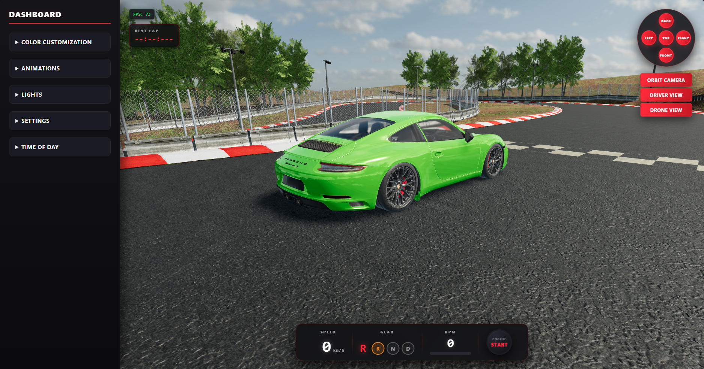
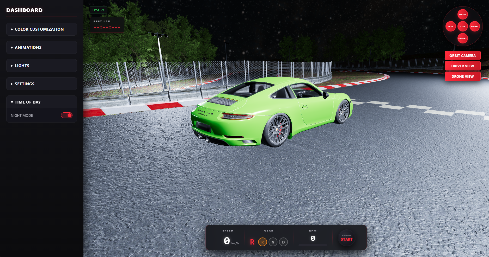

# Enigma

Enigma is a browser-based, real-time 3D car experience built with
WebGL. It lets the user drive a car around a race track using a
physics-based driving model, customize the car, interact with it, while tracking your best lap time.

| | |
|-|-|
|||

Try it live [here](https://sapienzainteractivegraphicscourse.github.io/final-project-enigma/).

## Controls

### Driving controls

| Input | Action |
|---|---|
| W | Accelerate |
| S / Space | Brake |
| A / Right arrow | Steer |
| S / Space | Brake lights on (while held) |
| E / HUD engine button | Start / stop the engine (with crank sound) |
| HUD gear selector (N / D / R) | Neutral / Drive / Reverse |
| Left Shift | Upshift gears in order Reverse, Neutral, Drive |
| Left Control | Downshifts gears in order Drive, Neutral, Reverse |

### Camera controls

| Input / button | Action |
|---|---|
| Mouse drag (orbit mode) | Rotate the camera around the car |
| Mouse scroll (orbit mode) | Zoom in / out (clamped range) |
| Up/Left/Down/Right Arrow keys, Right/Left Control (free mode) | Fly forward/back/left/right, down/up |
| Mouse drag (free / driver mode) | Look around |
| "Orbit Camera" / "Free Camera" button | Toggle between orbit and free-fly |
| Compass buttons (Front/Back/Left/Right/Top) | Jump to a preset view |
| "Driver View" button | First-person onboard camera |
| "Drone View" button | Top-down camera following the car |

## Technical aspects
For a more in detail technical explanation of the project take a look at this [document](docs/presentation.pdf).